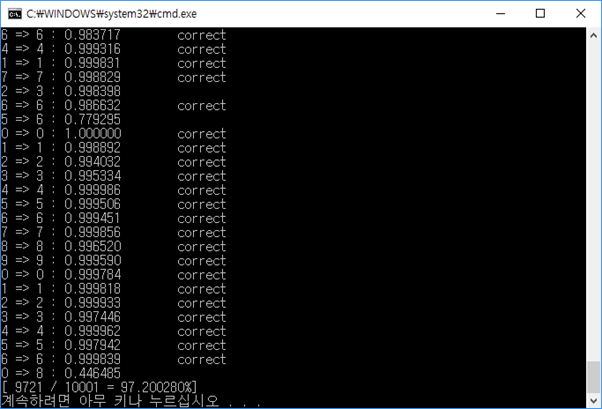
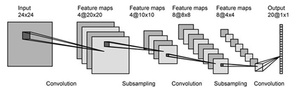
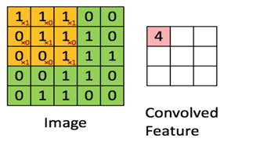
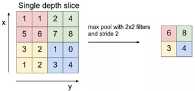
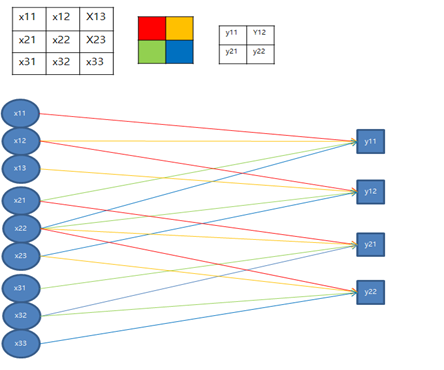
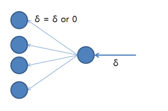
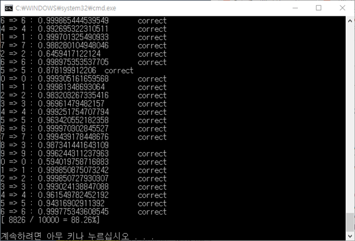

# CS_Convolution-Neural-Network
- **심층 신경망(Deep Neural Network) 이란?**
  : 심층 신경망과 일반적인 신경망의 핵심적인 차이점은 층의 깊이 입니다. 전통적인 기계학습 알고리즘은 하나의 입력층과 하나의 출력층으로 이루어져 있으며 많아야 중간에 하나의 은닉층을 가지고 있습니다. 이러한 구조의 신경망을 얕은 신경망이라 하고, 입력층과 출력층을 포함해 3계층 이상인 즉, 2개 이상의 은닉층을 가진 경우에 깊은 신경망이라고 합니다.

  

- **합성곱 신경망 (Convolution Neural Network)**

  기존의 신경망은 이미지를 인식할 때 여러가지의 문제점이 있다. 예를 들어 이미지가 회전되어 있거나, 크기가 커지거나, 이미지에 변형이 조금만 생기면 새로운 학습 데이터를 넣어주지 않으면 좋은 결과를 기대하기 어려운에 CNN을 사용하면, 이런 문제를 해결할 수 있다. CNN은 일반적인 뉴럴 네트워크 앞에 전처기 과정인 여러 계층의 컨볼루셔널 계층을 붙인 형태이다. 앞의 컨볼루셔널 계층을 통해 입력 받은 이미지에 대한 특징(Feature)를 추출하게 되고, 이렇게 추출된 특징을 기반으로 기존 뉴럴 네트워크를 이용하여 분류를 하게 된다. 
  CNN의 과정은 다음과 같은 다음과 같이 크게 3단계로 이루어진다.
  \1.   특징을 추출하는 단계. – Convolution
  \2.   topology변화에 영향을 받지 않도록 하는 단계. – Sub sampling
  \3.   분류 단계 – Classification
  대부분의 영상 인식 알고리즘에서는 특징을 추출하기 위해 filter를 사용한다. 보통 핉는 5x5 혹은 3x3과 같은 작은 영역에 대해 적용 하며, 필터에 사용하는 계수들의 값에 따라 각각 다른 특징을 얻을 수 있다. 일반적으로 이 filter의 계수들은 특정 목적에 따라 고정이 되지만, CNN에서 사용하는 filter 혹은 Convolutional Layer는 학습을 통해 최적의 계수를 결정할 수 있게 하는 점이 다르다. 통상적으로 sub-sampling은 보통 고정된 위치에 있는 픽셀을 고르거나, 혹은 sub-sampling 윈도우 안에 있는 픽셀들의 평균을 취한다.
  이동이나 변형 등에 무관한 학습 결과를 보이려면, 강하고 글로벌한 특징을 추출해야 하는데, 이를 위해 통상적으로 Convolution + Sub sampling 과정을 여러 번을 거치게 되면, 좀 더 전체 이미지를 대표할 수 있는 글로벌한 특징을 얻을 수 있게 된다. 이렇게 얻어진 특징을 fully-connected network를 통해 학습을 시키게 되면, 2차원 영상 정보로부터 topology 변화에 강인한 인식 능력을 갖게 된다.

컨볼루션은 신호처리 분야에서 가장 많이 사용되는 연산 중 하나입니다. 기본적으로 입력 신호에 특정 형태의 필터를 씌어 슬라이딩하여 결과를 얻습니다.

서브 샘플링 단계에서는 풀링 작업을 하게 되는데, 인접한 유닛들을 이용하여 가장 큰 값만 내보내거나, 평균값을 내보낸다. 즉 인접한 값들을 표현하기 위한 방법이다. 이 과정을 통해 신경망은 파라미터의 개수나 연산량을 줄일 수 있고, 학습 하지 않은 이미지에 대한 성능이 향상 된다

컨볼루션 및 풀링 레이어 또한 역전파를 하게 되는데, 컨볼루션 단계의 역전파를 이해하기 위해 일반 신경망의 그림으로 변환하면 다음과 같다.

일반적인 신경망에서는 다음 레이어의 각 노드가 이전 레이어의 모든 노드들과 연결된 가중치가 존재한다. 하지만 합성곱 신경망에서의 Convolution 단계는 위의 그림에서 보듯이, 지역적인 연결이 이루어진 신경망으로 이해가 가능하다. 따라서 각 가중치가 연결된 노드에 영향을 끼친 정도를 구하여, 에러 역전파 및 가중치에 해당하는 필터를 갱신한다.

풀링 레이어의 역전파 또한 아래의 그림으로 보면 이해가 쉽다. 흔히 최대값 풀링으로 2x2 윈도우의 안에서 풀링 작업을 하게 되므로. 해당 윈도우 안에서 풀링이 된 위치에만 역전파를 하고 다른 공간은 0이 된다.

--------------------------

mnist로 핛습 한 결과는 정확도가 약 88%로  성능은 전에 만든 일반 ANN 딥러닝 보다 안나오지만 
알고리즘 학습을 위한것이기 때문에 만족스러운 결과이다.

**이제 얌전히 텐서플로우 써야겠다.**

